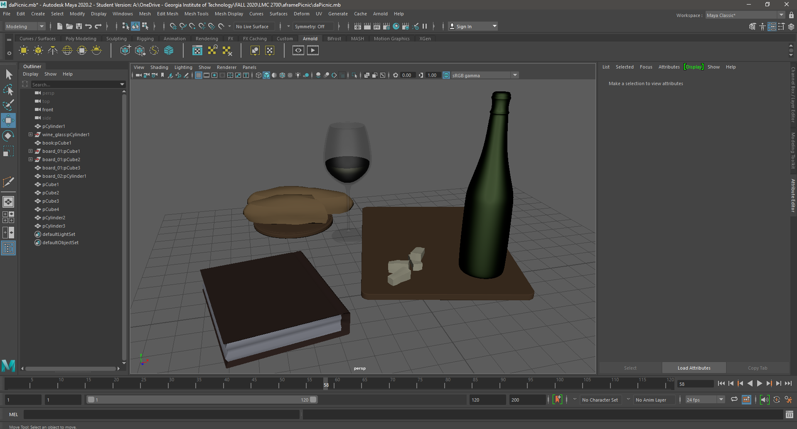

## Hey! [This](https://lockeprimus.com/aframePicnic/) is my Aframe 3D Graphic Scene for LMC 2700 based on a picnic scene:

The 3D scene seems to work best on Edge because Chrome does not allow autoplay without a JS workaround. 

### I created the models in Autodesk Maya, but simply changed the textures to a solid color for easy loading. 

Here are my references:

* The song playing is "Wandering Soul" by Asher Fulero
* The 360 img is from the Equirectangular group on [Flickr](https://www.flickr.com/groups/equirectangular/)
